#  **Tebello "ranks" Rankuatsana**

[](https://git.io/typing-svg)

### *Cybersecurity Enthusiast | Design Enthusiast | 3d Modelling & Animation Enthusiast | Software Development*

```
$ whoami
> ranks
```
```
  ____             _          
 |  _ \ __ _ _ __ | | ___  
 | |_) / _` | '_ \| |/ / 
 |  _ < (_| | | | |   <  
 |_| \_\__,_|_| |_|_|\_\
       R A N K S
```
```
$ sudo apt-get update && sudo apt-get upgrade
> Knowledge upgraded successfully.

$ git commit -m "small improvements every day"
> 1 file changed, future improved
```
---

     


            
 

    

                          

# About Me:
I go by the name "ranks", I'm a curious individual with a deep interest in **learning**, whether it be **3d Modelling**, **Java** ,**Javascript** ,**Cybersecurity** and **full-stack development**. I enjoy deep diving into complex topics and turning my curiosity into practical skills.<br/>
<br/>
**NB: I'm also a tekken Master(self-proclaimed)**

```
$ uptime
> Currently fostering skills in: 3D Modelling, Linux, Networking, Java and delivering punishment in tekken
```

# What I'm Learning Right Now
```
$ learning --current
> ISC2 Certification in Cybersecurity
> Linux fundamentals
> Database Systems(Advanced SQL Concepts)
> Probability & Statistics
> Networking fundamentals
> Secure backend development
> JavaFX
> Cloud deployment & DevOps
> NoSQL(Neo4j, MongoDB)
> 3d Modelling in 3ds Max
> Frontend Design(using the dreaded CSS and ReactJS)
> AI and ML basics
> Discrete Mathematics
> Javascript
> 3d Animation
```
# Goals
```
$ goals --2026
> Publish multiple production ready projects
> Contribute to open-source projects
> Mastery of Advanced SQL and NoSQL concepts
> Strengthen cloud & DevOps skills
> Deepen cybersecurity knowledge(currently enrolled in ISC2 CC)
> Build strong system design foundations
> Improve my 3d Modelling skills
> Learn 3d Character Animation
> Create an app/webapp that integrates AI and ML
```


# My Stats:


<br/>
<p align="center">
  <a href="https://github.com/Tebello-Rankuatsana">
    
  </a>
</p>


<br/>

<p align="center">
  
</p>

## Reach out:
[](mailto:justranku@gmail.com) [](https://www.linkedin.com/in/tebello-rankuatsana-635b37289/)


###  Dev Quote


---
[](https://visitcount.itsvg.in)


<div align="center">
  
</div>⠀⠀⠀

⠀⠀⠀⠀⠀⠀⠀⠀⠀⠀⠀⠀⠀⠀⠀⠀⠀⠀⠀⠀⠀⠀⠀⠀⠀⠀⠀⠀⠀⠀⠀⠀
```
  ____             _          
 |  _ \ __ _ _ __ | | ___  
 | |_) / _` | '_ \| |/ / 
 |  _ < (_| | | | |   <  
 |_| \_\__,_|_| |_|_|\_\
       R A N K S
```


```
                    ⠀⠀⠀⠀⣠⣶⣶⣶⣶⣤⡀⠀⠀⠀⠀⠀⠀⠀⠀⠀⠀⠀⠀⠀⠀⠀⠀⠀⠀⠀⠀⠀⠀⠀⠀⠀⠀⠀⠀⠀⠀⠀⠀⠀⠀⠀⠀⠀⠀⠀⣠⣴⣶⣶⣶⣄⠀⠀⠀⠀
                    ⠀⠀⠀⢰⣿⠋⠀⠀⠉⢻⣿⡆⠀⠀⠀⠀⠀⠀⠀⠀⠀⠀⠀⠀⠀⠀⠀⠀⠀⠀⠀⠀⠀⠀⠀⠀⠀⠀⠀⠀⠀⠀⠀⠀⠀⠀⠀⠀⠀⣾⣿⠋⠀⠀⠉⣿⣆⣀⠀⠀
                    ⢀⣶⣿⠿⠿⠀⠀⠀⠀⢠⣿⠇⠀⠀⠀⠀⠀⠀⠀⠀⠀⠀⠀⠀⠀⢀⣀⣀⣀⣀⣀⣀⣀⣀⣀⠀⠀⠀⠀⠀⠀⠀⠀⠀⠀⠀⠀⠀⠀⣿⡇⠀⠀⠀⠀⠛⠻⢿⣷⡄
                    ⢸⣿⠁⠀⠀⠀⠀⠀⠀⢻⣿⣆⠀⠀⠀⠀⠀⠀⢀⣀⣤⣶⣶⣿⣿⣿⣿⣿⠿⠿⠿⠿⣿⣿⣿⣿⣿⣷⣶⣤⣄⡀⠀⠀⠀⠀⠀⢀⣴⣿⠟⠀⠀⠀⠀⠀⠀⠀⣿⣷
                    ⠘⣿⣧⡀⠀⢀⣀⠀⠀⠀⠙⢿⣷⣄⠀⢀⣴⣾⣿⣿⠿⠟⠋⠉⠁⠀⠀⠀⠀⠀⠀⠀⠀⠀⠀⠈⠉⠙⠛⠿⣿⣿⣷⣦⣀⠀⣰⣿⠟⠁⠀⠀⠀⣠⣀⠀⠀⣠⣿⠇
                    ⠀⠈⠻⠿⠿⠿⢿⣷⣄⠀⠀⠀⠙⣿⣿⣿⡿⠟⠋⠀⠀⣀⣠⣤⣶⣶⣿⣿⣿⣿⣿⣿⣿⣿⣶⣶⣦⣤⣀⠀⠀⠉⠻⢿⣿⣿⣿⠋⠀⠀⠀⣠⣾⡿⠿⢿⣿⠿⠋⠀
                    ⠀⠀⠀⠀⠀⠀⠀⠙⢿⣷⣄⣠⣾⣿⡿⠋⠀⠀⣠⣴⣿⣿⣿⣿⣿⣿⣿⣿⣿⣿⣿⣿⣿⣿⣿⣿⣿⣿⣿⣿⣶⣄⡀⠀⠙⠿⣿⣷⣄⣠⣾⡿⠃⠀⠀⠀⠀⠀⠀⠀
                    ⠀⠀⠀⠀⠀⠀⠀⠀⠀⢹⣿⣿⡿⠋⠀⢀⣴⣿⣿⣿⣿⣿⡿⠟⠛⠉⠉⠀⠀⠀⠀⠀⠀⠈⠉⠙⠛⠿⣿⣿⣿⣿⣿⣦⡀⠀⠘⢿⣿⣿⣏⠀⠀⠀⠀⠀⠀⠀⠀⠀
                    ⠀⠀⠀⠀⠀⠀⠀⠀⣴⣿⣿⠟⠀⠀⣴⣿⣿⣿⣿⡿⠛⠁⠀⠀⠀⠀⠀⠀⠀⠀⠀⠀⠀⠀⠀⠀⠀⠀⠀⠙⢿⣿⣿⣿⣿⣦⡀⠀⠙⣿⣿⣧⠀⠀⠀⠀⠀⠀⠀⠀
                    ⠀⠀⠀⠀⠀⠀⢀⣾⣿⣿⠋⠀⢠⣾⣿⣿⣿⣿⠋⠀⠀⠀⠀⠀⠀⠀⠀⠀⠀⠀⠀⠀⠀⠀⠀⠀⠀⠀⠀⠀⠀⠙⢿⣿⣿⣿⣿⣄⠀⠘⢿⣿⣷⡀⠀⠀⠀⠀⠀⠀
                    ⠀⠀⠀⠀⠀⠀⣾⣿⣿⠃⠀⢠⣿⣿⣿⣿⣿⣁⣀⣀⣤⣤⣤⣤⣤⠶⠶⠶⠶⠶⠶⠶⠶⠶⠶⠶⢶⣤⣤⣤⣤⣤⣌⣿⣿⣿⣿⣿⣆⠀⠈⢿⣿⣷⠀⠀⠀⠀⠀⠀
                    ⠀⠀⠀⠀⠀⢸⣿⣿⠃⠀⢠⣿⣿⣿⣿⡿⠛⠉⠉⠉⠀⠀⣀⣀⣀⣀⣀⣀⣀⣀⣀⣀⣀⣀⣀⣀⣀⣀⣀⣀⠀⠀⠉⠉⢻⣿⣿⣿⣿⣆⠀⠈⣿⣿⣇⠀⠀⠀⠀⠀
                    ⠀⠀⠀⠀⠀⣿⣿⡏⠀⢠⣿⣿⣿⣿⡿⠷⠶⠞⠛⠛⠛⠋⠉⠉⠉⠉⠉⠁⠀⠀⠀⠀⠀⠀⠉⠉⠉⠉⠉⠉⠙⠛⠛⠛⠺⠿⠿⣿⣿⣿⣆⡀⠘⣿⣿⡄⠀⠀⠀⠀
                    ⠀⠀⠀⠀⢸⣿⣿⡶⠾⠛⠋⠉⠁⠀⢀⣠⣤⣶⡶⠶⠾⠛⠛⠛⠛⠛⠋⠉⠉⠉⠉⠉⠉⠙⠛⠛⠛⠛⠛⠛⠻⠿⠷⠶⢶⣤⠀⠀⠀⠈⠉⠛⠻⠿⣿⣇⠀⠀⠀⠀
                    ⠀⠀⠀⠀⢸⣿⣥⣤⣤⣀⣀⣀⣀⣰⣿⠉⠁⠀⠀⠀⠀⠀⠀⠀⠀⠀⠀⠀⠀⠀⠀⠀⠀⠀⠀⠀⠀⠀⠀⠀⠀⠀⠀⠀⠀⢹⣧⣀⣤⣤⣤⡤⠴⢶⣿⣿⠀⠀⠀⠀
                    ⠀⠀⠀⠀⣼⣿⡇⠀⢸⣿⣿⣿⣿⣿⣿⠀⠀⠀⠀⣠⣶⣿⣿⣿⣿⣶⣄⠀⠀⠀⠀⠀⠀⣠⣶⣿⣿⣿⣿⣷⣦⡀⠀⠀⠀⣼⣿⣿⣿⣿⣿⡇⠀⢸⣿⣿⠀⠀⠀⠀
                    ⠀⠀⠀⠀⢿⣿⡇⠀⢸⣿⣿⣿⣿⣿⣿⡄⠀⠀⣰⣿⣿⣿⣿⣿⣿⣿⣿⣧⠀⠀⠀⠀⣸⣿⣿⣿⣿⣿⣿⣿⣿⣷⠀⠀⠀⣿⣿⣿⣿⣿⣿⡇⠀⢸⣿⣿⠀⠀⠀⠀
                    ⠀⠀⠀⠀⢸⣿⣷⠀⠀⣿⣿⣿⣿⣿⣿⣧⠀⠀⣿⣿⣿⣿⣿⣿⣿⣿⣿⣿⠀⠀⠀⠀⣿⣿⣿⣿⣿⣿⣿⣿⣿⣿⠀⠀⣸⣿⣿⣿⣿⣿⣿⠇⠀⢸⣿⣿⠀⠀⠀⠀
                    ⠀⠀⠀⠀⢸⣿⣿⠀⠀⢿⣿⣿⣿⣿⣿⣿⣇⠀⢹⣿⣿⣿⣿⣿⣿⣿⣿⡿⠀⠀⠀⠀⠹⣿⣿⣿⣿⣿⣿⣿⣿⡿⠀⢠⣿⣿⣿⣿⣿⣿⣿⠀⠀⣿⣿⡟⠀⠀⠀⠀
                    ⠀⠀⠀⠀⠈⣿⣿⡇⠀⠘⣿⣿⣿⣿⣿⣿⣿⣦⠀⠙⢿⣿⣿⣿⣿⡿⠟⠁⠀⣀⣀⡀⠀⠙⠿⣿⣿⣿⣿⡿⠟⠁⣰⣿⣿⣿⣿⣿⣿⣿⡏⠀⢠⣿⣿⠇⠀⠀⠀⠀
                    ⠀⠀⠀⠀⠀⢹⣿⣿⡀⠀⠹⣿⣿⣿⣿⣿⣿⣿⣷⣄⠀⠀⠉⠉⠁⠀⠀⠀⢸⣿⣿⣿⠀⠀⠀⠀⠈⠉⠀⠀⣠⣾⣿⣿⣿⣿⣿⣿⣿⡟⠀⠀⣾⣿⡟⠀⠀⠀⠀⠀
                    ⠀⠀⠀⠀⠀⠈⢿⣿⣷⡀⠀⠹⣿⣿⣿⣿⣿⣿⣿⣿⣷⣦⣀⠀⠀⠀⠀⠀⠈⠻⠿⠋⠀⠀⠀⠀⠀⢀⣤⣾⣿⣿⣿⣿⣿⣿⣿⣿⡿⠁⠀⣼⣿⡿⠁⠀⠀⠀⠀⠀
                    ⠀⠀⠀⠀⠀⠀⠈⢿⣿⣷⡀⠀⠙⣿⣿⣿⣿⣿⣿⣿⣿⣿⣿⣿⣶⣦⣤⣄⣀⣀⣀⣀⣠⣤⣤⡶⣾⣿⣿⣿⣿⣿⣿⣿⣿⣿⣿⠟⠀⠀⣼⣿⡿⠁⠀⠀⠀⠀⠀⠀
                    ⠀⠀⠀⠀⠀⠀⠀⠈⢿⣿⣿⣄⠀⠈⠻⣿⣿⣿⣿⣿⣿⣿⣿⣿⣅⣸⡏⠉⢹⡟⠛⢻⡋⠉⣿⣀⣸⣿⣿⣿⣿⣿⣿⣿⣿⡿⠃⠀⢠⣾⣿⡟⠁⠀⠀⠀⠀⠀⠀⠀
                    ⠀⠀⠀⠀⠀⠀⠀⢀⣴⣿⣿⣿⣷⣄⠀⠈⠻⢿⣿⣿⣿⣿⣿⡇⠈⣿⠛⠓⣿⠷⠶⢾⡗⠛⢻⡏⠀⣿⣿⣿⣿⣿⣿⠟⠉⠀⢀⣴⣿⣿⠿⣿⣦⡀⠀⠀⠀⠀⠀⠀
                    ⠀⣠⣶⣿⣿⣶⣶⣿⠟⠁⠈⠻⣿⣿⣷⣄⠀⠀⠙⠻⢿⣿⣿⡷⢴⣯⣀⣀⣿⠀⠀⢸⣇⣀⣠⣷⡶⣿⣿⣿⠟⠋⠁⠀⣠⣴⣿⣿⡟⠁⠀⠈⠻⣿⣶⡿⢿⣶⣄⠀
                    ⢰⣿⠋⠁⠀⠈⠙⠁⠀⠀⢀⣴⣿⠟⢿⣿⣿⣶⣄⡀⠀⠈⠙⢿⡀⠀⠉⠉⠉⠉⠉⠉⠉⠉⠁⠀⢰⡟⠉⠀⠀⣠⣴⣾⣿⡿⠟⠻⣿⣦⡀⠀⠀⠈⠁⠀⠀⠙⣿⡆
                    ⢸⣿⡀⠀⠀⠀⠀⠀⠀⢴⣿⠟⠁⠀⠀⠈⠛⢿⣿⣿⣷⣶⣤⣀⣻⣦⣄⡀⠀⠀⠀⠀⠀⢀⣠⣴⣏⣠⣴⣶⣿⣿⡿⠟⠉⠀⠀⠀⠈⣻⣿⠆⠀⠀⠀⠀⠀⠀⣿⡇
                    ⠈⠿⣷⣦⣴⡆⠀⠀⠀⢸⣿⠀⠀⠀⠀⠀⠀⠀⠈⠙⠛⠿⣿⣿⣿⣿⣿⣿⣿⣷⣶⣾⣿⣿⣿⣿⣿⣿⠿⠟⠋⠁⠀⠀⠀⠀⠀⠀⢠⣿⡇⠀⠀⠀⠀⣶⣶⣾⠿⠁
                    ⠀⠀⠀⠉⣿⣇⡀⠀⣀⣾⣿⠀⠀⠀⠀⠀⠀⠀⠀⠀⠀⠀⠀⠀⠉⠉⠙⠛⠛⠛⠛⠛⠛⠛⠉⠉⠀⠀⠀⠀⠀⠀⠀⠀⠀⠀⠀⠀⠈⢿⣷⣄⠀⠀⣠⣿⠇⠀⠀⠀
                    ⠀⠀⠀⠀⠈⠛⠿⠿⠿⠛⠁⠀⠀⠀⠀⠀⠀⠀⠀⠀⠀⠀⠀⠀⠀⠀⠀⠀⠀⠀⠀⠀⠀⠀⠀⠀⠀⠀⠀⠀⠀⠀⠀⠀⠀⠀⠀⠀⠀⠀⠙⠻⠿⠿⠟⠋⠀⠀⠀⠀

```
